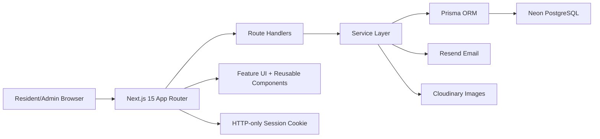
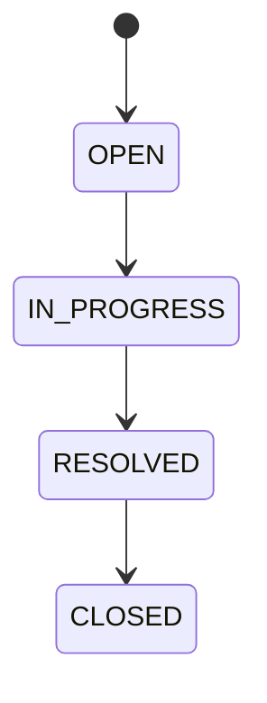

# ResidentFlow AI System Design

## Overview

ResidentFlow AI is a society maintenance tracker designed as a small production SaaS. Residents submit complaints, admins triage and update them, important notices are published to the society, and dashboards expose operational health through metrics and charts.

## Goals

- Provide authenticated, role-aware resident and admin workflows.
- Preserve a complete complaint lifecycle history.
- Detect likely duplicate complaints without external AI APIs.
- Offer analytics for status, category, trend, overdue work, and resident satisfaction.
- Keep the architecture deployable on Vercel with a Neon PostgreSQL database.

## Architecture

## Data Model

- `User`: residents and admins with role, flat number, phone, auth account/session links.
- `Complaint`: core issue record with title, description, category, priority, status, due date, resident.
- `ComplaintHistory`: immutable timeline entries for every status change.
- `Attachment`: Cloudinary-backed complaint images.
- `Rating`: resident satisfaction score after resolution.
- `Notice`: admin notices with pinned and important flags.
- `ComplaintFollower`: lets residents follow duplicate or related complaints.
- `SystemSetting`: stores configurable operational settings such as overdue threshold.

## Complaint Lifecycle

Every transition writes `ComplaintHistory` with actor, timestamp, previous status, next status, and optional note.

## Smart Complaint Assistant

The assistant uses deterministic keyword matching in `utils/complaint-assistant.ts`. It maps words like `leak`, `pipe`, and `water` to `PLUMBING/HIGH`, and `spark`, `wire`, and `power` to `ELECTRICAL/URGENT`. This satisfies the assignment requirement without external AI APIs.

## Duplicate Detection

`findDuplicateComplaints` fetches the resident's most recent active complaints and compares token overlap with a Jaccard-style score. Results above the threshold are returned as possible duplicates.

## Authentication And Authorization

ResidentFlow AI stores password hashes with bcrypt and creates HTTP-only session cookies backed by the `Session` table. Server pages use `requireUser` to protect resident and admin routes. API handlers call `getCurrentUser` and enforce role checks before mutating complaints, notices, ratings, or settings. The Better Auth handler and schema-compatible auth tables remain available for migration to full Better Auth flows.

## Photo Handling

Residents can attach an image when creating a complaint. The API accepts multipart form data and streams the image to Cloudinary. The resulting secure URL and public ID are stored in `Attachment`.

## Notification Flow

Important notices and complaint status updates send email through Resend when `RESEND_API_KEY` is configured. Email is optional for local development, but production deployments should configure Resend to satisfy the notification requirement.

## Performance

- Prisma queries use `select` to avoid over-fetching.
- Dashboard aggregations use `groupBy`, `aggregate`, indexed filters, and transactions.
- Common list paths are indexed in `schema.prisma`.
- Recharts components are client-isolated to keep server routes lean.
- TanStack Query is configured with a default stale time to reduce refetch churn.

## Security

- Zod validates route input.
- Middleware adds security headers.
- API responses disable caching.
- Prisma prevents SQL injection by using typed query builders.
- Passwords are hashed with bcrypt and sessions use HTTP-only cookies.
- Production requires strong `BETTER_AUTH_SECRET`, HTTPS app URL, and scoped third-party keys.

## Accessibility

- Navigation uses semantic landmarks and labels.
- Inputs are associated with labels.
- Empty states and errors are textual, not color-only.
- Buttons and links include visible focus rings.
- Charts are paired with surrounding headings and metric summaries.

## Deployment

Vercel deployment requires:

- `DATABASE_URL`
- `BETTER_AUTH_SECRET`
- `BETTER_AUTH_URL`
- optional `RESEND_API_KEY`, `NOTICE_FROM_EMAIL`
- optional Cloudinary credentials

Build command: `npm run build`

After deploying, run Prisma migrations against the production Neon database.
